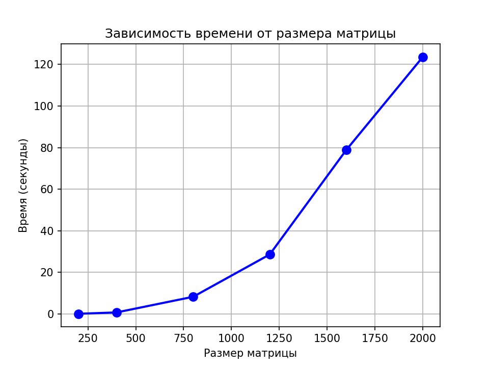

# Лабораторная работа №1

## 1. Задание:
Написать программу на языке C/C++ для перемножения двух квадратных матриц.
- Исходные данные: файл(ы) содержащие значения исходных матриц.
- Выходные данные: файл со значениями результирующей матрицы, время выполнения, объем задачи.
- Обязательна автоматизированная верификация результатов вычислений с помощью сторонних библиотек или стороннего ПО (например на Matlab/Python).

## 2. Программа:
- 'matrix_utils.py' - генерация матриц и верификация
- 'matrix_multiplier.cpp' - умножение матриц

## 3. Эксперименты с разными размерами матриц
| Размер матрицы | Время (с) | Операций |
|----------------|-----------|----------|
| 200 × 200 | 0.082 | 16×10⁶ |
| 400 × 400 | 0.737 | 128×10⁶ |
| 800 × 800 | 8.261 | 1024×10⁶ |
| 1200 × 1200 | 28.612 | 3456×10⁶ |
| 1600 × 1600 | 78.875 | 8192×10⁶ |
| 2000 × 2000 | 123.603 | 16000×10⁶ |

## 4. Выводы
- Время выполнения растёт пропорционально O(n³), что соответствует теоретической сложности алгоритма
- Верификация: результаты совпали

