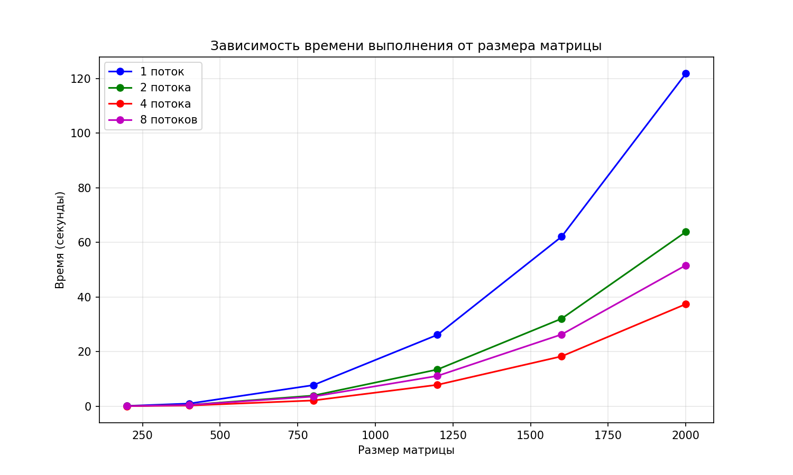

# Лабораторная работа №2

## 1. Задание:
Модифицировать программу из лабораторной работы №1 для параллельной работы по технологии OpenMP
Провести серию экспериментов:
-с разным количеством потоков (1, 2, 4, 8)
-с разными размерами матриц (200, 400, 800, 1200, 1600, 2000)
-с разным количеством вычислительных ядер при наличии технической возможности, иначе использовать фиксированное существующее количество вычислительных ядер (4)

## 2. Программа:
-'matrix_utils.py' - генерация матриц и верификация 
-'matrix_multiplier_omp.cpp' - умножение матриц с использованием OpenMP

## 3. Эксперименты с разными размерами матриц
Результаты измерений (время в секундах)
| Размер матрицы | 1 поток | 2 потока | 4 потока | 8 потоков |
|----------------|---------|----------|----------|-----------|
| 200 × 200 | 0.121 | 0.064 | 0.064 | 0.060 |
| 400 × 400 | 0.965 | 0.488 | 0.262 | 0.452 |
| 800 × 800 | 7.717 | 3.890 | 2.108 | 3.536 |
| 1200 × 1200 | 26.148 | 13.446 | 7.834 | 11.095 |
| 1600 × 1600 | 62.090 | 32.065 | 18.268 | 26.278 |
| 2000 × 2000 | 121.800 | 63.829 | 37.388 | 51.598 |

## 4. Выводы
- Время выполнения растёт пропорционально O(n^3)?что соответствует теоретической сложности алгоритма умножения матриц
- Использование OpenMP позволяет эффективно распараллелить вычисления. Наилучшее ускорение достигается при использовании 4 потоков, что соответствует количеству физических ядер процессора (4 ядра)
- При использовании 8 потоков производительность снижается по сравнению с 4 потоками из-за накладных расходов на переключение контекста и ограничений аппаратного обеспечения
- Верификация: результаты умножения совпали с эталонными, вычисленными с помощью библиотеки NumPy в Python
