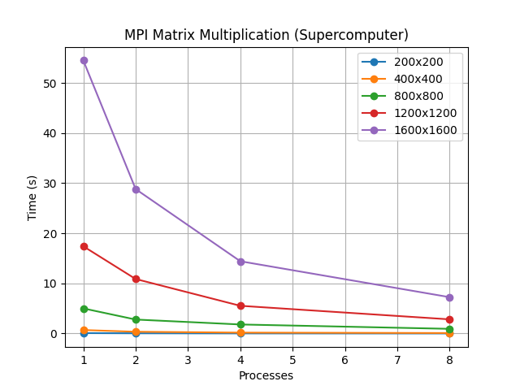

# Лабораторная работа №5

## 1. Задание:
Параллельную версию программы на MPI нужно запустить на суперкомпьютере «Сергей Королёв».

## 2. Программа:
-'matrix_multiplier_omp.cpp' - умножение матриц с использованием MPI

## Результаты экспериментов
| Размер матрицы | Процессы | Время (сек) |
|----------------|----------|-------------|
| 200x200 | 1 | 0.0822348 |
| 200x200 | 2 | 0.0425924 |
| 200x200 | 4 | 0.0213436 |
| 200x200 | 8 | 0.010952 |
| 400x400 | 1 | 0.692844 |
| 400x400 | 2 | 0.350373 |
| 400x400 | 4 | 0.177486 |
| 400x400 | 8 | 0.0936665 |
| 800x800 | 1 | 5.00878 |
| 800x800 | 2 | 2.78688 |
| 800x800 | 4 | 1.80292 |
| 800x800 | 8 | 0.930419 |
| 1200x1200 | 1 | 17.4047 |
| 1200x1200 | 2 | 10.8762 |
| 1200x1200 | 4 | 5.53012 |
| 1200x1200 | 8 | 2.82599 |
| 1600x1600 | 1 | 54.4905 |
| 1600x1600 | 2 | 28.8189 |
| 1600x1600 | 4 | 14.4186 |
| 1600x1600 | 8 | 7.25091 |

## 4. Выводы
-MPI-программа успешно масштабируется на суперкомпьютере
-Увеличение количества процессов позволяет ускорить вычисления
-Наибольший выигрыш от параллелизации наблюдается для больших матриц

